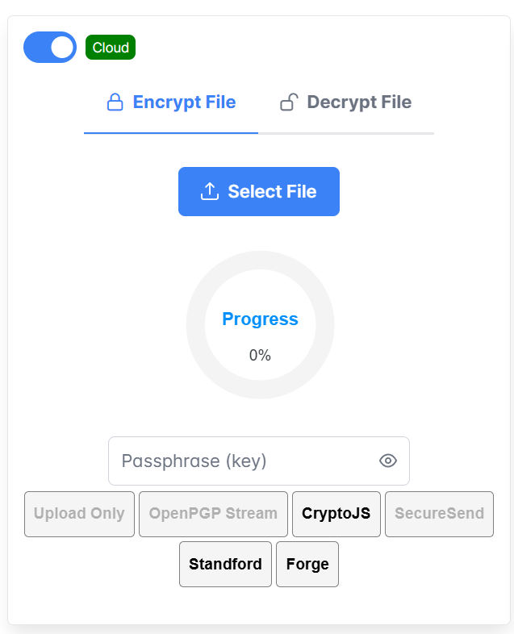

# Client-Side Encryption: The Key to Confidentiality for Cloud Storage

Client-Side Encryption: The Key to Confidentiality for Cloud Storage

### About this project

This project aims to demonstrate how businesses can maintain data privacy controls for data in the Cloud through self-managed encryption keys . Our open-source Crypto-Middleware package integrates as a proxy before you send data to the cloud, for now we support AWS S3, or your local disk.&#x20;

The end result is End-to-End encryption for your sensitive data.

### Qualitative Objectives

* Maintain Confidentiality, Integrity & Authenticity
* Large File Encryption & Decryption
* High Entropy
* Browser only,  no server side encryption.
* Large file encryption & decryption without exhausting memory > 5GB
* Optional PKI to share keys

## Motives

Cloud breaches have exposed millions of plaintext data across industries, with inherent risks in relying on cloud infrastructure for data security. SecureFile demonstrates this by using our opensource  browser middleware acting as a secure proxy to read, encrypting and save data before it leaves the client's environment, ensuring cloud providers only handle encrypted data without access to decryption keys.

## Package Contents

<table data-full-width="true"><thead><tr><th>Title</th><th>Location</th><th>Description</th><th>Usage</th></tr></thead><tbody><tr><td>Crypto-Middleware</td><td>./crypto-middleware</td><td>Middleware proxies your File object in a stream and outputs a encrypted Readable stream.</td><td><code>npm i crypto-middleware</code></td></tr><tr><td>SecureFile</td><td>./demo</td><td>Client side application demonstrating ways in which Crypto-middleware can be sued with comparison and monitoring included.</td><td><code>cd demo</code><br><code>npm install</code><br><code>npm run dev</code></td></tr><tr><td></td><td></td><td></td><td></td></tr><tr><td>Crypto-CLI</td><td>./crypto-cli</td><td>NodeJS terminal proof of concept wrapper around openssl.</td><td><code>node index</code></td></tr></tbody></table>

## Prerequisites

* Browser that supports Streams API (Chrome 89+, Edge 89+, FireFox 102+, Opera 76+, sorry Safari) [https://caniuse.com/?search=streams](https://caniuse.com/?search=streams)
* NodeJS Version 16.00 or above for building 'SecureFile' for demonstration
* Thats it!

## SecureFile Demo Installation

`git clone` [`https://github.com/hkuspace-pu/Secure-File-RishiUttam-COMP3000HK.git`](https://github.com/hkuspace-pu/Secure-File-RishiUttam-COMP3000HK.git)

`cd Secure-File-RishiUttam-COMP3000HK`

`npm install`

npm run dev

<div data-full-width="true">

<figure><figcaption><p>SecureFile Demo page.</p></figcaption></figure>

</div>

### How to use

<div align="left">

<figure><figcaption><p>This is a typical file upload component that integrates the crypto-middleware module.</p></figcaption></figure>

</div>

Our tool compares some popular cryptographic js implementation libraries such as:

1. OpenPGP ([https://github.com/openpgpjs/openpgpjs](https://github.com/openpgpjs/openpgpjs))
2. CryptoJS ([https://github.com/brix/crypto-js](https://github.com/brix/crypto-js))
3. Stanford University ([https://crypto.stanford.edu/sjcl/](https://crypto.stanford.edu/sjcl/))
4. ForgeJS ([https://github.com/digitalbazaar/forge](https://github.com/digitalbazaar/forge))
5. **SecureSend** (Our demo, this page!)

### Setup your cloud keys.

<div align="left">

<figure><figcaption></figcaption></figure>

</div>

If you would like to use the cloud to upload your encrypted files, set your AWS keys within the **.env** file located in the project root&#x20;

````
```properties
VITE_APP_accessKeyId=<Your Access Key ID>
VITE_APP_MY_secretAccessKey=<Your secret access Key>
VITE_APP_S3REGION=<Your S3 Region>
VITE_APP_S3REGION=<Your S3 Bucket>
```
````

Currently we support only AWS S3 keys, as a proof of concept, practically we can  support any provider with API/SDK access.


Your keys are stored within the  .env file and when required are used in memory only, they are not stored, coped or transmitted anywhere else.   Make sure you set a secure bucket policy and do not use your root access keys. If you do not want to use the Cloud to upload your files, you can toggle to use local disk.\
&#x20;.png>)

